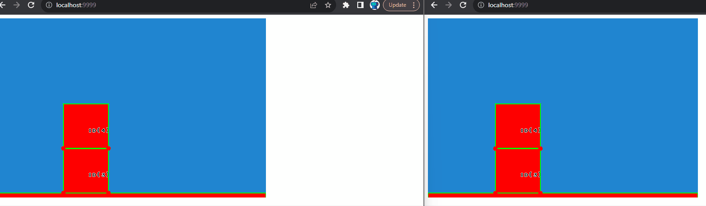

## Excalibur Physics Server

Example of using a node server to run the Excalibur physics simulation. Still a work in progress!

⚠️Currently this only works off a branch of excalibur https://github.com/excaliburjs/Excalibur/tree/bugfix/run-excalibur-in-node

## Running Locally

* Install Node.js
* Build the front end with parcel `npm run build`
* Run the file and websocket server `npm run server`
* Navigate to `http://localhost:9999`